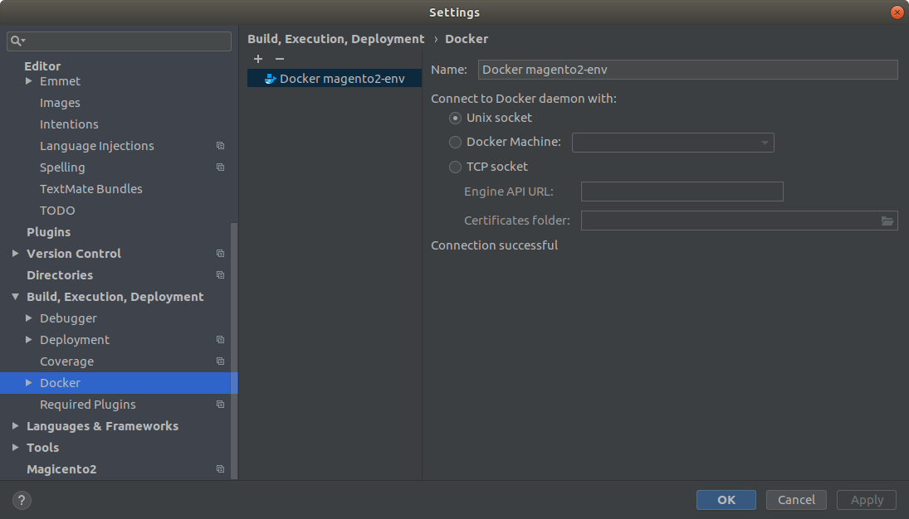
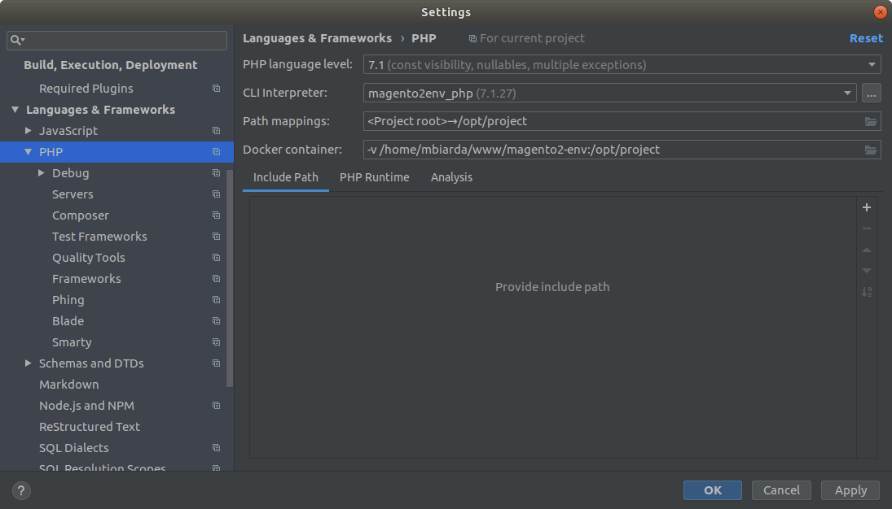
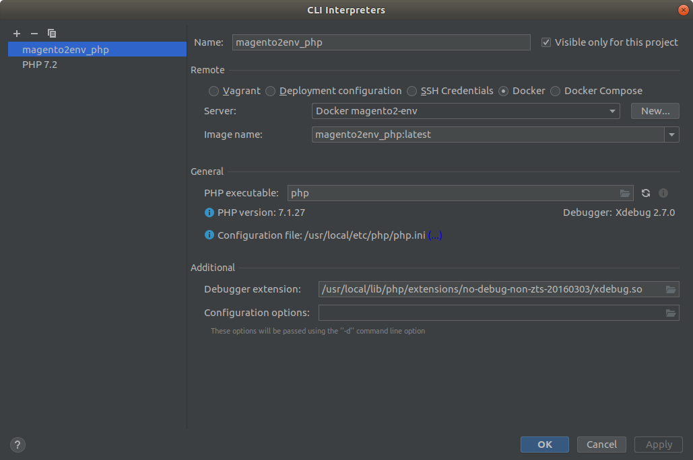
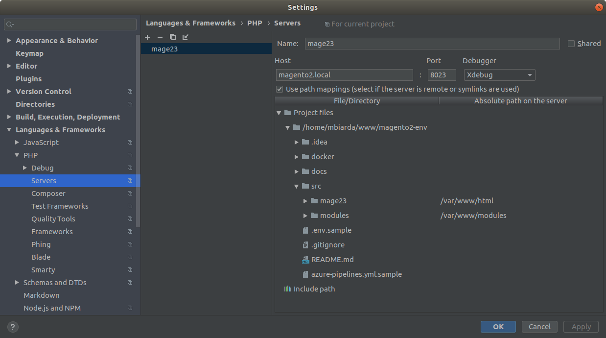
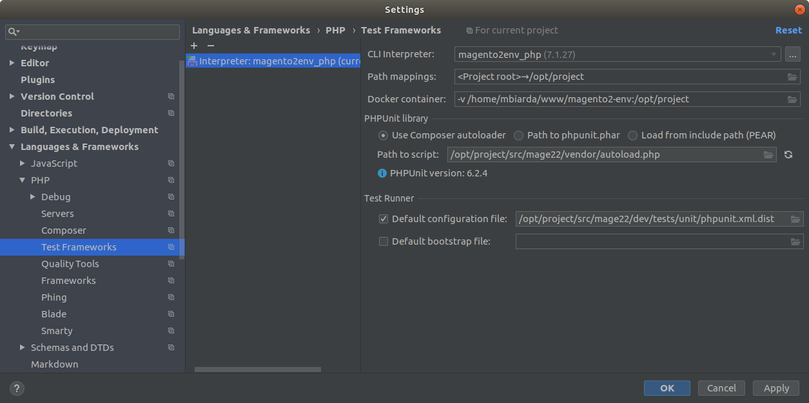

This project is ABANDONNED


Magento 2 Local Development Environment
=======================================

## 1. Overview

The purpose of this repo is to provide Magento 2 extensions developers an easy to setup local environment.

The setup was created using Docker, on top of the following images repository: https://github.com/thecodingmachine/docker-images-php (please check this repo for more info about technology stack, assumptions, etc.).

The setup was created on Ubuntu 18.04 and is tested on this OS, however the plan is to make it OS-agnostic.

In current state the setup includes three Magento versions: 2.1.17, 2.2.8 and 2.3.2. They are all installed with sample data.

**Disclaimer:** In many places of this README file the following strings are used as placeholders for version numbers:
* For Magento: `<MAGE_VER>`. Please replace it with `21` for Magento 2.1.17, `22` for Magento 2.2.8 or `23` for Magento 2.3.2.
* For PHP-CLI: `<PHP_VER>`. Please replace it with `71` for PHP 7.1 or `72` for PHP 7.2.

## 2. Prerequisites
      
In order to setup this environment you need Docker and Docker Compose installed on your machine.

## 3. Installation

1. Clone this repository.
2. Copy `.env.sample` file to `src/mage<MAGE_VER>/.env`.
3. Customize `.env` files if you need.
4. CD to `src/mage<MAGE_VER>` and run `docker-compose up`.
5. Add `127.0.0.1 magento2.local` to your local hosts file (on Ubuntu: `/etc/hosts`).
6. Your Magento frontend will be accessible by the following URL: `https://magento2.local:80<MAGE_VER>`.
7. Your Magento backend will be accessible by the following URL: `https://magento2.local:80<MAGE_VER>/admin`. Admin credentials can be found in `.env` file.

## 4. Additional setup

### 4.1. SSL certificates

Import `docker/app/files/magento2root.pem` root certificate to your browsers so they don't complain about self-signed certificates.

If you need to access Magento URLs not only from your browsers (eg. CURL), import the root certificate to your OS.

### 4.2. PHPStorm

#### 4.2.1. Docker

1. Open Settings.
2. Go to "Build, Execution, Deployment" > "Docker".
3. Add new Docker server with default config.



#### 4.2.2. PHP

1. Open Settings.
2. Go to "Languages & Frameworks" > "PHP".
3. Set "PHP language level" to the version you will be using.
4. Create new remote PHP interpreter using Docker:
    * Use Docker server created in 4.2.1
    * Use `magento2env_phpcli<PHP_VER>:latest` Docker image
    * Set "Debugger extension":
        * for PHP 7.1: `/usr/local/lib/php/extensions/no-debug-non-zts-20160303/xdebug.so`
        * for PHP 7.2: `/usr/local/lib/php/extensions/no-debug-non-zts-20170718/xdebug.so`
 




#### 4.2.3. PHP Server

1. Open Settings.
2. Go to "Languages & Frameworks" > "PHP" > "Servers".
3. Add new server:
    * Name it `mage<MAGE_VER>`
    * Put `magento2.local` as a host
    * Put `80<MAGE_VER>` as a port
    * Put `Xdebug` as a debugger
    * Set path mapping:
        * `src/mage<MAGE_VER>` > `/var/www/html`
        * `src/modules` > `/var/www/modules`

 

#### 4.2.4. Xdebug

No configuration needed for debugging browser requests. See: https://www.jetbrains.com/help/phpstorm/zero-configuration-debugging.html

#### 4.2.5. PHPUnit

1. Open Settings.
2. Go to "Languages & Frameworks" > "PHP" > "Test Frameworks".
3. Add new config:
    * Use CLI interpreter created in 4.2.2
    * Use Composer autoloader with following path to script: `/opt/project/src/mage<MAGE_VER>/vendor/autoload.php`
    * Set Default configuration file to `/opt/project/src/mage<MAGE_VER>/dev/tests/unit/phpunit.xml.dist`



#### 4.2.6. E-mail communication

No configuration needed. All e-mails sent by Magento are caught by MailHog. Simply open http://127.0.0.1:8125 in your browser to check them.

## 5. Common routines

### 5.1. Run already installed Magento

```
cd src/mage<MAGE_VER>
docker-compose up
```

### 5.2. Go inside container (SSH like) 

First find `mage<MAGE_VER>` container name by running `docker ps`. Then run `docker exec -it <container name> /bin/bash`, example: `docker exec -it magento2env_mage22_1_fcb38b06f0c6 /bin/bash`.

When you're inside, you act as `docker` user and you can perform any console command (also with `sudo`), eg. `bin/magento`.

### 5.3. Set up your Magento extension to be developed locally

1. GIT clone your extension to `src/modules/<VENDOR>/<Extension>`, eg. `src/modules/Orba/Payupl`.
2. Add your extension as a dependency to Composer, using `src/mage<MAGE_VER>/composer.json` file. Set the same version as in extension's `composer.json` file. Example:
    ```
    {
        ...
        "require": {
            ...
            "orba/magento2-payupl": "2.0.0-dev"
        }
        ...
    }
    ```
3. Go inside container (see: 5.2).
4. Run `composer update`.
5. Run `bin/magento setup:upgrade` inside container.
6. If your extension uses template files, you need to set config value "Advanced > Developer > Template Settings > Allow Symlinks" to "Yes".

**Disclaimer:** `composer.json` file is created automatically from a template during first `docker-compose up` run.

**Watchout:** This setup requires that your extension's `registration.php` looks like this:

```php
<?php
\Magento\Framework\Component\ComponentRegistrar::register(
    \Magento\Framework\Component\ComponentRegistrar::MODULE,
    'Vendor_Extension',
    isset($file) ? dirname($file) : __DIR__
);
```

This is a workaround for symbolic links issue.

### 5.4. Xdebug console script

1. Enable Listening for PHP Debug Connections (green icon in toolbar)
2. Go inside container (see: 5.2).
3. Run `export XDEBUG_CONFIG="idekey=123"` (this is needed only once per session).
4. Run your PHP script with the following param: `-dxdebug.remote_enable=1`, eg. `php -dxdebug.remote_enable=1 bin/magento`.

## 6. Contribution

Please don't hesitate to create an issue if you found any bug.

Also, please suggest your enhancements either via an issue or a pull request.
